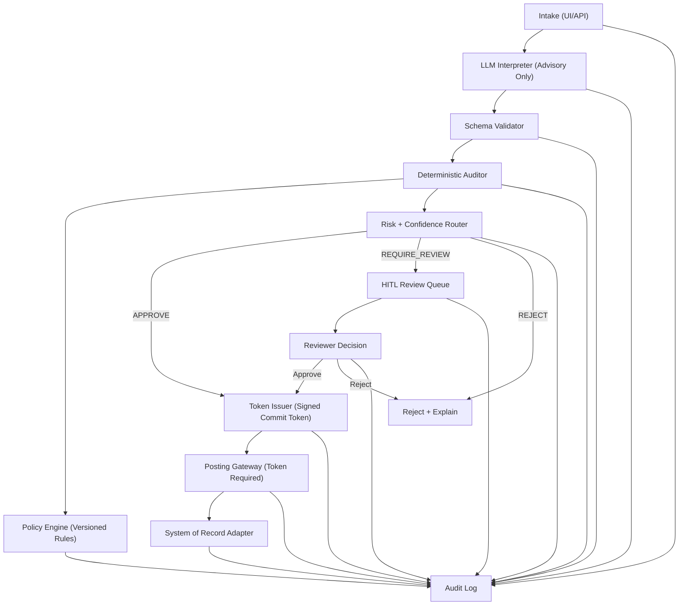
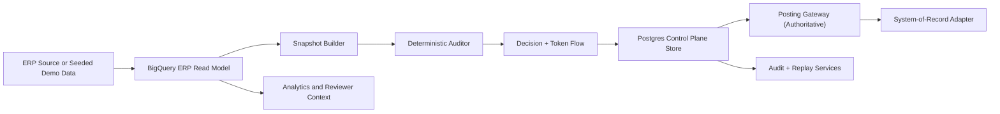

# Prototype Definition: Regulated AI Decision Support Control Plane

Status: Canonical prototype build specification  
Owner: Bo Aina  
Last updated: 2026-02-20

## 1) What the prototype is

This prototype is a governed AI decision-support system for regulated spend workflows (starting with grants expenditure) where:

- an LLM interprets request context and proposes structured intent
- a deterministic control plane decides whether any state mutation is allowed
- irreversible actions are blocked unless policy checks pass and an approval token is issued
- all decisions are logged in a replayable audit trail

Short definition:

> A compliance-first architecture where probabilistic AI may propose, but deterministic controls must approve before posting.

## 2) Why this prototype exists

This prototype is the execution proof for your strategy:

- You are not positioning as "AI hobbyist" or model trainer.
- You are positioning as an HLS solutions engineer who can design and build safe deployment architecture for probabilistic AI in regulated systems.
- The artifact should demonstrate technical depth (Python/API integration), governance depth (policy/audit/HITL), and deployment realism (failure handling, observability, replay).

## 3) Business problem statement

In regulated financial and healthcare operations, incorrect decisions are not just bad answers; they can become irreversible system mutations with compliance consequences.

Examples:

- unallowable grant spend gets posted
- out-of-period transaction is committed
- missing documentation is bypassed
- a recommendation is accepted without traceable rationale

Core risk:

- LLM outputs are probabilistic and can be wrong.
- Systems of record require deterministic and auditable commit logic.

Prototype objective:

- Keep model capability for interpretation and triage.
- Remove model authority to mutate source-of-truth systems.

## 4) Governing invariants

These are non-negotiable rules the prototype enforces:

1. No direct model-to-ERP writes.
2. Every proposed mutation is schema-validated before evaluation.
3. Every mutation decision is policy-versioned and snapshot-bound.
4. Any high-risk ambiguity routes to human review.
5. Posting endpoint rejects requests without valid auditor-issued token.
6. Every decision is replayable from logged artifacts.

## 5) Scope and boundaries

### In scope (MVP -> hardened prototype)

- Structured intent extraction from unstructured request input
- Deterministic auditor service with rule engine
- Policy versioning and policy lifecycle (draft, shadow, active, rollback)
- Confidence and risk routing (approve, reject, require_review)
- Human-in-the-loop review workflow
- Signed mutation token and non-bypassable posting gate
- Immutable-style audit logging with replay package
- Basic RAG grounding against versioned policy corpus
- Evaluation harness with golden tests and regression checks

### Out of scope

- Training or fine-tuning foundation models
- Autonomous agents with commit authority
- Production-grade multi-region infrastructure
- Full enterprise IAM and SIEM integration
- Real PHI in development data

## 6) Primary use case

### Domain

- Healthcare and Life Sciences financial governance
- Initial scenario: grant expenditure allowability check before posting

### Event to evaluate

- A user submits spend transaction context plus supporting evidence.
- The model proposes a structured classification and rationale.
- Deterministic controls decide whether the transaction can post.

### Mutation boundary

Posting is any action that changes financial state or causes external effects, including:

- GL journal creation
- payment release
- cost transfer commit
- sponsor reporting submission

## 7) Personas and user surfaces

### Primary personas

- Grant Accountant (GA): evaluates exceptions and audit readiness
- Research Administrator (RA): validates allowability documentation
- Compliance/Audit Officer (CT): needs replayable evidence and policy lineage
- Supervisor/Director (SUP): monitors risk and exception backlog

### Interfaces

- Intake UI: capture request, attachments, metadata
- Reviewer UI: deterministic violations, evidence, citations, approval actions
- Admin UI: policy versions, threshold tuning, shadow results
- Audit UI/export: replay package and decision ledger

## 8) High-level architecture



### 8.1 Hybrid data architecture (BigQuery + Postgres)

Data responsibility split:

- BigQuery is the analytical/read-model representation of ERP data used for deterministic evaluation context and reporting.
- Postgres is the authoritative transactional store for control-plane decisions, token lifecycle, workflow state, idempotency keys, and replay pointers.
- Posting authority is enforced by the Postgres-backed control path, never by BigQuery query results alone.



## 9) Component responsibilities

### 9.1 Intake service

- Accepts request payload and files
- Normalizes metadata (request_id, actor_id, timestamp, channel)
- Computes input hash and trace id
- Sends moderation/sanitization pre-checks

### 9.2 LLM interpreter (advisory)

- Uses structured output mode to produce `IntentObject`
- No system credentials for posting or mutations
- Outputs classification, extracted fields, and rationale draft

### 9.3 Schema validator

- Enforces strict JSON contract
- Rejects malformed or incomplete outputs
- Routes schema failures to review path

### 9.4 Deterministic auditor

- Loads active policy version
- Pulls state snapshot needed for rule evaluation (materialized from BigQuery read model)
- Runs deterministic rules against `(intent, snapshot, policy_version)`
- Produces `AuditorDecision` and violation list

### 9.5 Confidence + risk router

- Maps calibrated confidence and risk class to routing outcome
- Enforces strict escalation for high-impact transactions

### 9.6 HITL review queue

- Presents structured rationale and violated rules
- Requires reviewer action with explicit reason codes
- Captures override justification

### 9.7 Token issuer

- Signs short-lived commit token when decision is APPROVE
- Binds token to request id, decision hash, policy version, and expiry

### 9.8 Posting gateway

- Validates token signature and claims
- Enforces one-time use/idempotency key
- Rejects all mutation requests without valid token

### 9.9 Audit logger

- Writes append-only decision events
- Stores hashes, versions, decisions, reviewer actions, and token claims in Postgres-managed control-plane records
- Supports replay export

### 9.10 Replay/evaluation service

- Reconstructs decision path for a specific transaction
- Re-runs deterministic evaluator against historical artifacts
- Compares expected vs observed outcomes

## 10) Data contracts

### 10.1 IntentObject (model output)

```json
{
  "transaction_id": "txn_123",
  "grant_id": "GRANT-2026-001",
  "org_unit": "HLS-ONC",
  "amount": 5000.0,
  "currency": "USD",
  "object_code": "EQUIPMENT",
  "expense_date": "2026-02-18",
  "posting_date": "2026-02-20",
  "description": "PCR thermal cycler replacement",
  "evidence_refs": ["file_01", "file_02"],
  "model_confidence": 0.86,
  "risk_class": "medium",
  "rationale_summary": "Allowable under current budget category with complete documentation."
}
```

### 10.2 AuditorInput

```json
{
  "intent": {},
  "policy_version_id": "policy_v12",
  "policy_hash": "sha256:...",
  "state_snapshot_id": "snap_2026_02_20T19_00Z",
  "state_snapshot_hash": "sha256:...",
  "trace_id": "trace_abc"
}
```

### 10.3 AuditorDecision

```json
{
  "decision": "APPROVE",
  "violations": [],
  "requires_review": false,
  "decision_hash": "sha256:...",
  "evaluated_at": "2026-02-20T19:03:12Z",
  "policy_version_id": "policy_v12",
  "state_snapshot_id": "snap_2026_02_20T19_00Z"
}
```

### 10.4 Violation object

```json
{
  "rule_id": "R-ALLOW-003",
  "severity": "high",
  "message": "Object code disallowed for this grant.",
  "actual_value": "EQUIPMENT",
  "expected_condition": "object_code in allowed_codes"
}
```

### 10.5 Commit token claims

```json
{
  "token_id": "tok_789",
  "request_id": "req_456",
  "transaction_id": "txn_123",
  "decision_hash": "sha256:...",
  "policy_version_id": "policy_v12",
  "state_snapshot_hash": "sha256:...",
  "scope": ["post_grant_expense"],
  "issued_at": "2026-02-20T19:03:13Z",
  "expires_at": "2026-02-20T19:08:13Z",
  "one_time_use": true
}
```

### 10.6 Audit event envelope

```json
{
  "event_id": "evt_001",
  "trace_id": "trace_abc",
  "request_id": "req_456",
  "event_type": "auditor.decision",
  "actor_type": "system",
  "timestamp": "2026-02-20T19:03:12Z",
  "payload_hash": "sha256:...",
  "payload_ref": "s3://.../evt_001.json",
  "prev_event_hash": "sha256:..."
}
```

### 10.7 BigQuery ERP read-model tables (analytical representation)

These tables represent ERP-like entities for deterministic evaluation context and reviewer insight.

```sql
CREATE TABLE `demo_hls_erp.grants` (
  grant_id STRING NOT NULL,
  sponsor_id STRING,
  sponsor_name STRING,
  org_unit STRING,
  start_date DATE,
  end_date DATE,
  award_amount NUMERIC,
  budget_remaining NUMERIC,
  status STRING,
  updated_at TIMESTAMP
);

CREATE TABLE `demo_hls_erp.purchase_orders` (
  po_id STRING NOT NULL,
  grant_id STRING,
  vendor_id STRING,
  amount NUMERIC,
  currency STRING,
  po_date DATE,
  status STRING,
  created_at TIMESTAMP
);

CREATE TABLE `demo_hls_erp.invoices` (
  invoice_id STRING NOT NULL,
  po_id STRING,
  grant_id STRING,
  invoice_number STRING,
  amount NUMERIC,
  invoice_date DATE,
  due_date DATE,
  status STRING,
  created_at TIMESTAMP
);

CREATE TABLE `demo_hls_erp.labor_costs` (
  labor_cost_id STRING NOT NULL,
  grant_id STRING,
  employee_id STRING,
  cost_center STRING,
  effort_percent NUMERIC,
  amount NUMERIC,
  period_start DATE,
  period_end DATE,
  created_at TIMESTAMP
);

CREATE TABLE `demo_hls_erp.invoice_cost_allocations` (
  allocation_id STRING NOT NULL,
  invoice_id STRING,
  grant_id STRING,
  object_code STRING,
  alloc_amount NUMERIC,
  allocation_method STRING,
  created_at TIMESTAMP
);

CREATE TABLE `demo_hls_erp.snapshot_manifest` (
  snapshot_id STRING NOT NULL,
  as_of_ts TIMESTAMP NOT NULL,
  source_table STRING NOT NULL,
  row_count INT64,
  content_hash STRING,
  created_at TIMESTAMP
);
```

### 10.8 Postgres control-plane tables (authoritative)

These tables are authoritative for commit control, workflow state, and replay artifacts.

```sql
CREATE TABLE control_requests (
  request_id TEXT PRIMARY KEY,
  transaction_id TEXT NOT NULL,
  actor_id TEXT,
  trace_id TEXT NOT NULL,
  intent_json JSONB NOT NULL,
  snapshot_id TEXT NOT NULL,
  snapshot_hash TEXT NOT NULL,
  policy_version_id TEXT NOT NULL,
  model_id TEXT,
  created_at TIMESTAMPTZ NOT NULL DEFAULT NOW()
);

CREATE TABLE control_decisions (
  decision_id TEXT PRIMARY KEY,
  request_id TEXT NOT NULL REFERENCES control_requests(request_id),
  decision TEXT NOT NULL CHECK (decision IN ('APPROVE', 'REJECT', 'REQUIRE_REVIEW')),
  decision_hash TEXT NOT NULL,
  violations_json JSONB NOT NULL DEFAULT '[]'::jsonb,
  confidence NUMERIC,
  risk_class TEXT,
  decided_at TIMESTAMPTZ NOT NULL DEFAULT NOW()
);

CREATE TABLE control_review_actions (
  review_id TEXT PRIMARY KEY,
  request_id TEXT NOT NULL REFERENCES control_requests(request_id),
  reviewer_id TEXT NOT NULL,
  action TEXT NOT NULL CHECK (action IN ('APPROVE', 'REJECT', 'REQUEST_MORE_INFO')),
  reason_code TEXT,
  note TEXT,
  reviewed_at TIMESTAMPTZ NOT NULL DEFAULT NOW()
);

CREATE TABLE control_tokens (
  token_id TEXT PRIMARY KEY,
  request_id TEXT NOT NULL REFERENCES control_requests(request_id),
  decision_hash TEXT NOT NULL,
  scope TEXT NOT NULL,
  issued_at TIMESTAMPTZ NOT NULL,
  expires_at TIMESTAMPTZ NOT NULL,
  consumed_at TIMESTAMPTZ,
  is_revoked BOOLEAN NOT NULL DEFAULT FALSE
);

CREATE TABLE control_idempotency_keys (
  idempotency_key TEXT PRIMARY KEY,
  request_id TEXT NOT NULL REFERENCES control_requests(request_id),
  posting_result_hash TEXT,
  created_at TIMESTAMPTZ NOT NULL DEFAULT NOW()
);

CREATE TABLE audit_events (
  event_id TEXT PRIMARY KEY,
  trace_id TEXT NOT NULL,
  request_id TEXT NOT NULL REFERENCES control_requests(request_id),
  event_type TEXT NOT NULL,
  payload_hash TEXT NOT NULL,
  prev_event_hash TEXT,
  payload_json JSONB NOT NULL,
  created_at TIMESTAMPTZ NOT NULL DEFAULT NOW()
);
```

### 10.9 End-to-end authoritative flow (BigQuery vs Postgres)

1. Intake receives request and stores normalized request metadata in Postgres (`control_requests`).
2. Interpreter produces structured `IntentObject`; schema validator gates malformed output.
3. Auditor queries BigQuery read model (grants, POs, invoices, labor, allocations) and resolves `snapshot_id` from `snapshot_manifest`.
4. Auditor evaluates deterministic rules and writes decision to Postgres (`control_decisions`).
5. If review is required, reviewer action is written to Postgres (`control_review_actions`).
6. If approved, token issuer writes short-lived token to Postgres (`control_tokens`).
7. Posting gateway validates token/idempotency against Postgres (`control_tokens`, `control_idempotency_keys`).
8. Posting adapter executes mutation and writes result hash/audit chain entries in Postgres (`audit_events`).
9. BigQuery remains read-model and analytics context; it does not grant commit authority.

## 11) Deterministic rule set (initial)

Baseline rules for grants expenditure:

- `R-PERIOD-001`: expense_date must fall within grant period
- `R-BUDGET-002`: amount must not exceed available budget balance
- `R-ALLOW-003`: object_code must be in approved sponsor category
- `R-DOC-004`: required attachments must be present and valid
- `R-THRESH-005`: high-dollar transactions require second-level review
- `R-ORG-006`: org_unit must match authorized award structure
- `R-DUP-007`: duplicate invoice/transaction detection check
- `R-SNAP-008`: snapshot age must be within freshness threshold

Policy authoring requirements:

- each rule has owner, rationale, severity, and test cases
- policy versions are signed and immutable after activation
- every activation has shadow report and rollback plan

## 12) Confidence/risk routing policy

Illustrative routing grid:

- High confidence + low risk -> deterministic check -> possible straight-through approve
- Medium confidence or medium risk -> deterministic check + review queue
- Low confidence or high risk -> reject or require explicit reviewer adjudication

Non-bypass rule:

- High-impact categories (for example large dollar, restricted sponsor codes, period edges) always require review regardless of confidence.

## 13) Human-in-the-loop behavior

Reviewer requirements:

- Must see: intent fields, retrieved evidence, violated rules, policy version
- Must choose: approve, reject, request_more_info
- Must provide: reason code and note for approve overrides/rejects
- Must be tracked: reviewer id, timestamp, review duration

UI standards:

- no hidden auto-approval
- plain-language violation explanations
- links to source evidence and policy text
- explicit badge when stale snapshot or policy mismatch is detected

## 14) Security and compliance controls

Minimum control set:

- least privilege service accounts
- strict separation of model runtime and commit path credentials
- input moderation and injection screening
- output schema enforcement and enum validation
- PHI-aware field handling and redaction in logs
- token signature verification at posting gateway
- idempotency keys for write requests
- tamper-evident audit chain using hash linking

Trust boundary statement:

- Untrusted: model output text and user-submitted content
- Trusted: deterministic auditor, policy store, token issuer, posting gateway

## 15) Observability and SLOs

### Core metrics

- request volume by route (approve/review/reject)
- model schema failure rate
- reviewer queue depth and median wait time
- override rate by rule and by reviewer
- block rate by policy version
- token issuance and token rejection rates
- end-to-end latency by stage
- replay success rate

### Initial SLO targets

- 100% of posted mutations have valid token + decision hash
- >= 99% audit replay success for sampled transactions
- < 2% schema parse failure on clean inputs
- reviewer queue P95 wait under agreed threshold (for example 30 minutes for non-urgent queue)
- zero bypass events where posting occurs without valid token

## 16) Failure modes and safe degradation

Key failure classes and behavior:

1. Model timeout/failure
- Do not post
- Route to manual review or fail-safe reject
- Log timeout event with trace id

2. Schema validation failure
- Do not evaluate for auto-approve
- Route to review with parse error metadata

3. Policy store unavailable
- Freeze commit path
- Allow advisory-only preview with warning banner

4. Snapshot stale or missing
- Reject or review based on policy
- Never issue token on stale state if rule requires freshness

5. Token verification failure
- Hard reject at posting gateway
- raise security event

6. Audit logger outage
- Buffer with backpressure and freeze posting if durable write cannot be guaranteed

## 17) Evaluation and test strategy

### Test categories

- unit tests for deterministic rules
- schema contract tests for all intent versions
- integration tests across full workflow
- adversarial prompt/input tests
- policy regression tests between versions
- replay determinism tests
- performance tests for latency and queue behavior

### Golden dataset

Curate transaction cases including:

- clean allowables
- borderline period edges
- missing docs
- disallowed object code
- duplicate attempt
- high-dollar with proper docs
- high-dollar missing required approval

Each case includes expected deterministic outcome and expected route.

### Policy drift controls

- every policy change runs regression suite
- activation blocked without impact report:
  - block-rate delta
  - false-positive estimate
  - reviewer load forecast

## 18) Technical implementation blueprint

Reference stack for prototype speed and clarity:

- Backend: Python (FastAPI)
- Model integration: OpenAI Responses API with structured outputs
- Rule engine: deterministic Python evaluator (or lightweight policy engine adapter)
- Vector retrieval: embedding index for policy passages
- Data stores:
  - BigQuery for ERP read model/snapshots (`grants`, `purchase_orders`, `invoices`, `labor_costs`, `invoice_cost_allocations`)
  - Postgres for authoritative control-plane state (decisions, tokens, workflow, idempotency, audit chain)
- Cache/queue: Redis for queueing/retries (optional in MVP)
- Frontend: simple reviewer UI (Next.js or Streamlit)
- Packaging: Docker Compose for local demo environment

Repository structure suggestion:

```text
prototype/
  apps/
    api/
    reviewer-ui/
  services/
    intake/
    interpreter/
    auditor/
    token-gateway/
    replay/
  policies/
    versions/
    tests/
  data/
    golden_cases/
  docs/
    api_contracts/
    runbooks/
```

### 18.1 OpenAI API usage by phase (one-page matrix)

| Phase | Primary goal | OpenAI APIs used | What the API is doing | Required control guardrail | Interview proof artifact |
|---|---|---|---|---|---|
| Phase 1 (Weeks 1-4) | Safe intake and deterministic gating | Responses API (structured outputs), Models API | Produce strict `IntentObject`; log model ID/allowlist metadata | No direct mutation authority; schema failure routes to review; posting requires token | Demo of structured intent -> auditor decision -> token-gated posting |
| Phase 2 (Weeks 5-8) | Policy-grounded reasoning | Files API, Embeddings API, Vector Stores API, Responses API | Ingest policy docs, build retrieval index, attach citations to reviewer context | Retrieved citations logged with snapshot/version; citations never bypass deterministic rules | Reviewer screen showing decision + citations + policy version |
| Phase 3 (Weeks 9-12) | Governance hardening | Moderations API, Responses API, Files API | Screen unsafe/prompt-injection content; sanitize content before logs/UI | Unsafe content blocked or redacted; moderation outcomes auditable in event trail | Example adversarial input rejected/flagged with audit trace |
| Phase 4 (Weeks 13-16) | Evaluation and drift control | Batch API, Responses API, Embeddings API (optional for eval sets) | Run regression suites at scale; compare outcomes across policy/model versions | Policy activation blocked without impact report and pass thresholds | Batch regression report: block-rate delta, false positives, override trend |
| Cross-phase control | Traceability and governance continuity | Models API (allowlist + model metadata), Responses API | Enforce model governance and per-request model traceability | Only approved models callable; model/version always attached to decision record | Audit replay packet proving model + policy + snapshot lineage |

Recommended baseline from day one:

1. Must-have: Responses API, Models API.
2. Phase-2 readiness: Files API, Embeddings API, Vector Stores API.
3. Hardening/maturity: Moderations API, Batch API.

## 19) Build phases and milestones

### Phase 1: Safe intake + deterministic gate (Weeks 1-4)

Deliver:

- structured intent extraction
- schema validator
- deterministic auditor with core rules
- token-protected posting gateway stub
- basic audit events

Exit criteria:

- no post possible without token
- deterministic rules run on every request
- basic replay on single transaction

### Phase 2: RAG grounding + citations (Weeks 5-8)

Deliver:

- policy corpus ingestion
- retrieval-linked explanations
- citation logging

Exit criteria:

- reviewer can inspect policy citations per decision
- retrieval version/snapshot is logged

### Phase 3: Governance hardening (Weeks 9-12)

Deliver:

- policy version lifecycle (draft/shadow/active/rollback)
- moderation and injection checks
- improved audit envelope and hash chaining

Exit criteria:

- policy activation requires shadow report
- trust boundaries documented and validated in tests

### Phase 4: Evaluation and maturity (Weeks 13-16)

Deliver:

- golden test harness and regression pipeline
- metrics dashboards
- failure injection tests

Exit criteria:

- replay pass rate and zero-bypass checks pass
- policy change workflow is measurable and repeatable

## 20) Demo script (interview-grade)

10-15 minute flow:

1. Show risky intake example (missing or borderline data).
2. Show model structured output and confidence score.
3. Show deterministic auditor rejecting or requiring review.
4. Show reviewer decision with explicit reason.
5. Show token issuance after approval.
6. Show posting gateway accepting only tokenized commit.
7. Show full audit trace and replay package.
8. Show how rule update in shadow mode changes outcomes safely.

What this demonstrates:

- architecture thinking, not chatbot novelty
- practical governance controls
- model utility under deterministic oversight
- production-minded safety behavior

## 21) Deliverables checklist

Artifact set for this prototype:

- architecture diagram and component map
- API/data contracts document
- policy spec with rule test cases
- reviewer UX screenshots or recording
- audit replay example package
- evaluation report with key metrics
- known risks and mitigation plan
- concise narrative deck (problem -> architecture -> evidence -> outcomes)

## 22) Definition of done

Prototype is complete when all conditions below are true:

1. Model output cannot directly mutate system state.
2. Posting endpoint enforces valid signed token.
3. Deterministic policies are versioned and test-covered.
4. HITL path is functional with structured overrides.
5. Audit artifacts can replay decisions deterministically.
6. Failure modes degrade safely without silent mutation.
7. Demo can show end-to-end governance in one session.

## 23) Risks and mitigations

Risk: Over-optimizing architecture and under-building implementation  
Mitigation: time-box each phase and prioritize working path first

Risk: Reviewer fatigue from over-escalation  
Mitigation: tune thresholds with measured queue metrics and policy refinements

Risk: False confidence from model score  
Mitigation: use calibrated routing + deterministic hard gates

Risk: Policy drift  
Mitigation: signed versioning, regression gates, shadow activation

Risk: Ambiguous logs that fail audit review  
Mitigation: strict event schema + hash-linked envelopes + replay tests

